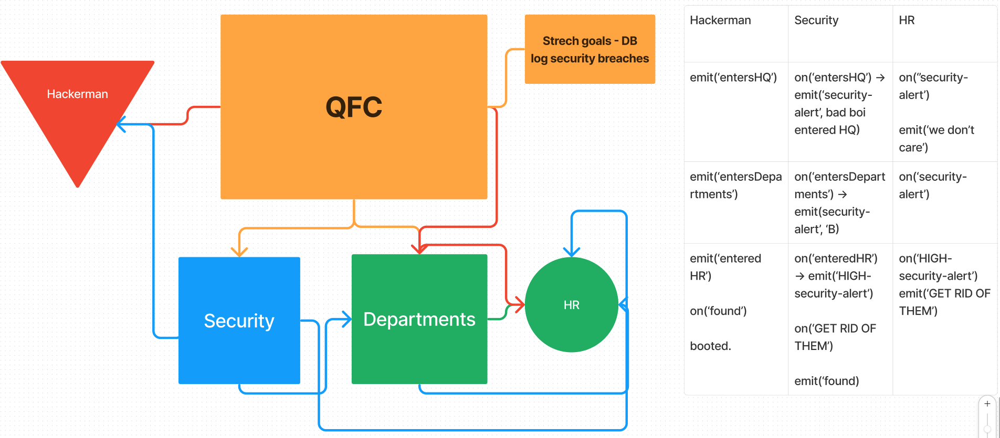

# Socket Secuirty

## 🛠️ Getting Started

### Requirements

For development, you will only need [Node](http://nodejs.org/) installed in your environment.
Please use the appropriate [Editorconfig](http://editorconfig.org/) plugin for your
Editor (not mandatory).

### Install

    git clone git@github.com/ZIIM/Socket-Security.git
    cd PROJECT
    npm install

### Start & watch

    npm start
    node ./clients/security
    node ./clients/hackerMan
    node ./clients/QFC/departments/HR/

## 🏗️ Architecture



```
.
├── .DS_Store
├── .github
│   └── workflows
│       └── node.yml
├── .gitignore
├── LICENSE
├── README.md
├── clients
│   ├── QFC
│   │   └── departments
│   │       └── HR
│   │           ├── handlers.js
│   │           ├── handlers.test.js
│   │           └── index.js
│   ├── hackerMan
│   │   ├── handlers.js
│   │   ├── handlers.test.js
│   │   └── index.js
│   └── security
│       ├── handlers.js
│       ├── handlers.test.js
│       └── index.js
├── lib
│   └── Queues.js
├── package-lock.json
├── package.json
├── server
│   └── hub.js
└── whiteboard
    └── whiteboard.png
```

### Languages & tools

* dotenv
* jest
* nodemon
* socket.io
* socket.io-client

## 🔄 Change Log

0.0.1 2024-04-18

## 🤝 Credit and Collaborations

[Isai Chaidez](https://github.com/Arvoya)

GitHub Copilot - Helped with writing tests
